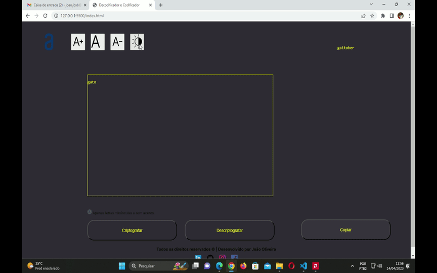

<h1 style="text-align: center; margin-top: 32px; margin-bottom: 32px;">Decodificador de texto</h1>

    <h2>Tecnologias utilizadas</h2>

<ul>
    <li style="list-style: none;">HTML</li>
    <li style="list-style: none;">CSS</li>
    <li style="list-style: none;">JavaScript</li>
</ul>

<h2>Funcionalidades</h2>
<ul>
<li>Criptografa e descriptogra o texto digitado</li>
<li>Tem o modo noturno</li>
<li>Aumenta e diminui o tamanho da fonte</li>
</ul>

